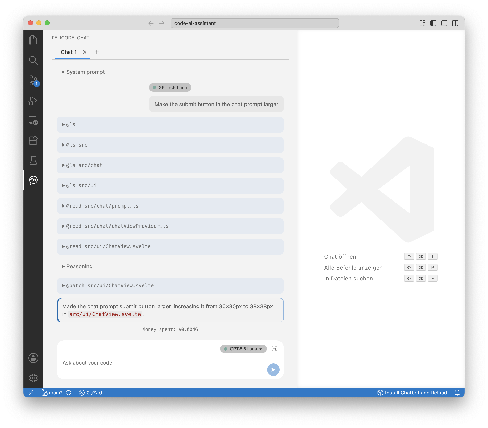

# PeliCode

<p align="center">
  
</p>

PeliCode is a very basic chat-agent harness for VS Code for educational purposes 
and my own usage on personal projects. It is focussed on making clear what 
exactly the agent is prompted rather than hiding it. It allows viewing and editing files, 
but not much else. The harness works very well with small
LLM models since it does not overload the context with long system prompts and many tools.

PeliCode is still under active development and is intended for experimentation rather
than production use. Most of its development has been dogfooded: PeliCode has
been used to develop PeliCode itself.

## Features

- Multiple local chat tabs with persisted history in the projects.
- Selectable OpenRouter models and displayed request costs.
- Workspace tools for listing, reading, writing, patching, moving, and removing
  files.
- Visible tool results and optional model reasoning in the chat.

Tool calls can modify files without a confirmation step. Only use PeliCode in a
workspace you trust, and review its changes as you would changes from any other
coding agent.

## Screenshot

<p align="center">
  
</p>

## Features still under development

- [x] Keep PeliCode file access strictly inside trusted workspace folders.
- [ ] Keep long chats and large file edits fast and cost-efficient, take context limit into account.
- [x] Extend PeliCode to accept remote control from other devices via WebSockets.
- [ ] Support selecting files across multi-root workspaces.
- [ ] Give each chat its own Git branch workspace.
- [ ] Compare several models and rank their answers by quality, time, and cost.
- [ ] Add an adversarial mode with an implementer and reviewer agent.
- [ ] Let users choose tool permission presets, including read-only access.
- [ ] Add an evaluation tool for checking agent work.
- [ ] Add focused Git tools for common repository tasks.

## OpenRouter

PeliCode requires an `OPENROUTER_API_KEY` in the environment that launches VS
Code. The default model is `openai/gpt-5.6-luna`, and other supported models can
be selected in the chat UI.

## Install locally

Package the extension and install the generated VSIX file:

```bash
npx @vscode/vsce package
code --install-extension pelicode-0.0.1.vsix
```

Reload the VS Code window after installation.


## Development

During development, the
`Install Chatbot and Reload` status-bar action rebuilds, installs, and reloads
the current VSIX when PeliCode is already installed.

Run `npm run compile` for type checks, linting, and a development build.

The code is split into the Svelte UI (`src/ui`), chat coordination and persistence
(`src/chat/chatViewProvider.ts`), OpenRouter requests (`src/chat/openRouterClient.ts`),
and workspace tools (`src/chat/tools`). Each tool is a plain object containing its
API schema and an `execute` function with named arguments. Tool argument parsing
and result formatting live beside the registry in `src/chat/tools/index.ts`.


## Browser chat and HTML export

The small **Remote control** toggle beside the chat tabs in the VS Code extension
starts and stops its HTML and WebSocket server. Remote control starts disabled
every time the extension loads; its enabled state is not saved. Enabling it copies the complete instance URL,
including `#key=…`, to the clipboard. Open this URL to connect directly to that
VS Code instance and use the same chat UI and tabs as in the sidebar.
The toggle also shows a QR code for this URL for ten seconds after enabling
remote control, and while hovering over or keyboard-focusing the enabled toggle.

Each running extension instance has one random key shared by all its chat tabs
and browser connections. The key stays the same when toggling remote control
within that instance and changes when the extension reloads. The server chooses
an available port on the first non-loopback IPv4 address each time it starts,
so use the latest copied URL or QR code.
WebSocket connections require the instance key. Disabling remote control closes
all browser connections and stops the server. Startup does not modify the clipboard.

**PeliCode: Open Browser Chat** enables remote control, copies its URL, and opens
the page. There is no instance discovery, connection form, or port scanning.
The page connects using the instance URL in the browser address bar. Use
**Reconnect** after a dropped connection, or open another copied URL to switch
instances. The extension sidebar can remain closed.

`npm run compile` and `npm run package` build the extension and standalone
`dist/chat.html`. `npm run export:html` exports just the HTML, including its
JavaScript and styles. `npm run dev` serves it at
`http://127.0.0.1:5173/chat.html` and rebuilds on changes; reload the page to see
them. For a live backend connection, open the instance URL copied by the extension.
The backend runs in VS Code, so install or rebuild the updated extension
and reload its window for backend changes.

The server binds to the selected network IP. Open the copied URL or scan the
QR code from a smartphone on the same local network. After changing networks,
turn remote control off and on again to refresh the address. Enabling remote
control requires a network IPv4 address. The OpenRouter API key remains in the extension host.
